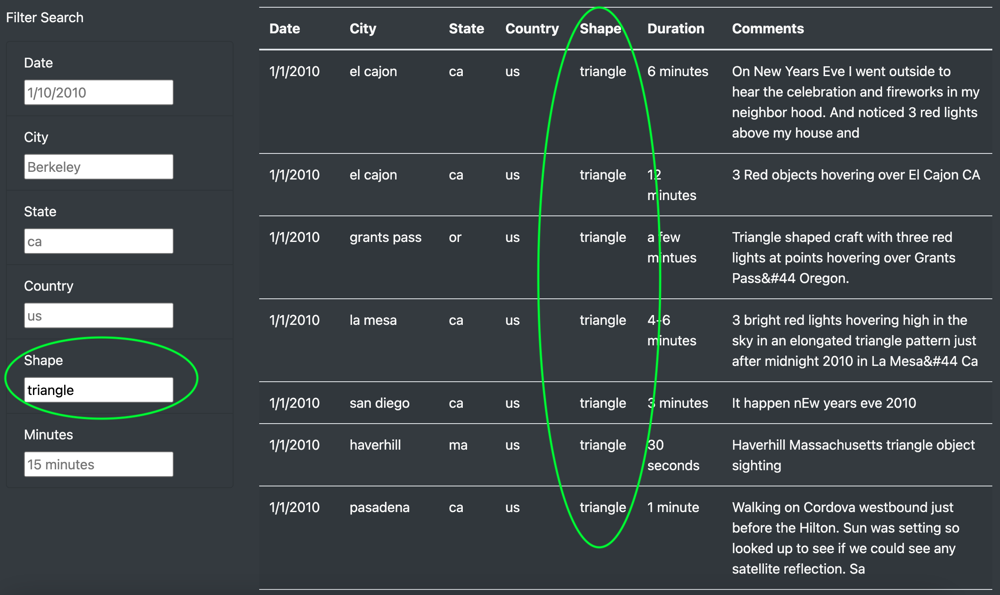
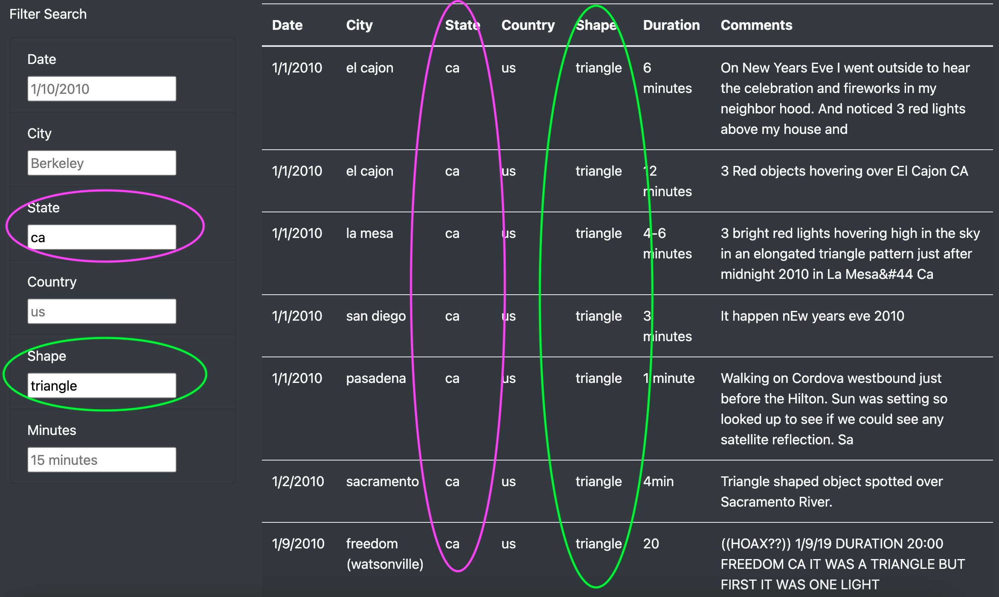

# UFOs
Module 11

## Overview of Project
In working with Dana, she wanted to create an interactive dashboard that would be impressive to NASA. First thing she wanted to create was a filterable table to display data around UFO sightings. We were able to complete this task by working with variables and lists. Next, we began to build a page using JavaScript. With JavaScript, we juggled a few files at once; HTML, JavaScript, images and a CSS Style sheet. We then utilized for loops to iterate through the data so that it could be added to the table we created. We then took advantage of Data-Driven Documents (D3) to make our table interactive. We did so by utilizing filters to access specific features in her data by using several different key terms, such as date or location. Once we finished, we decided to add color and an image on the webpage to make it more visually apealing.

## Results
### How to use UFO Finder
##### Title Page
When we navigate to UFO Finder, we first notice the title of the page and a brief description of UFO sightings

##### Interactive search funtion and Date Table
If we scroll down, we notice that there are search bars on the left and the data table listed to the right.

##### Enter a search option
As an example, if you were to enter "triangle" in the "shape" search bar, you will notice that the data list will only show occurences involving triangular sightings. When we apply this search, we notice that there are 18 occurences throughout the data.

##### Enter an additional search option
We can narrow down the search even further by adding an additinal search. In this example, we narrowed the search down by state, using California (ca) as our additional search topic. By adding ca to the already existing triangle search, we see that the data has narrowed down from 18 to 7 sightings.

##### Reset the Data Table
Once we are finished viewing the data, we can scroll to the top of the page and click "UFO Sightings" to reset the page.

## Summary
